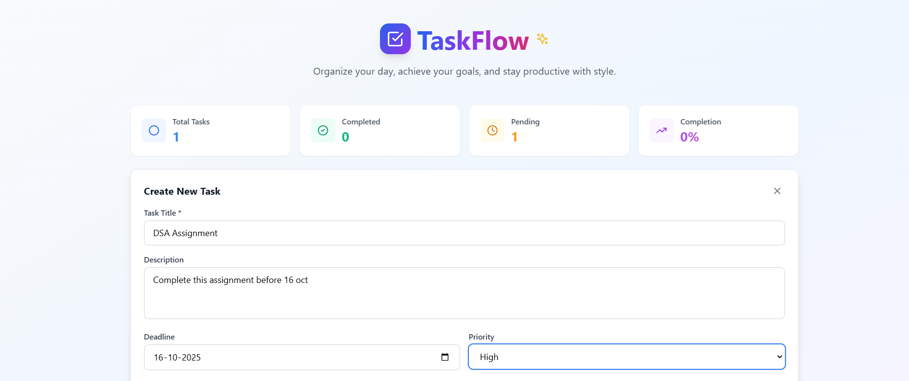
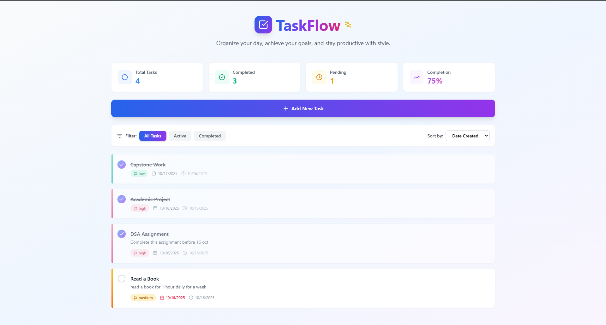
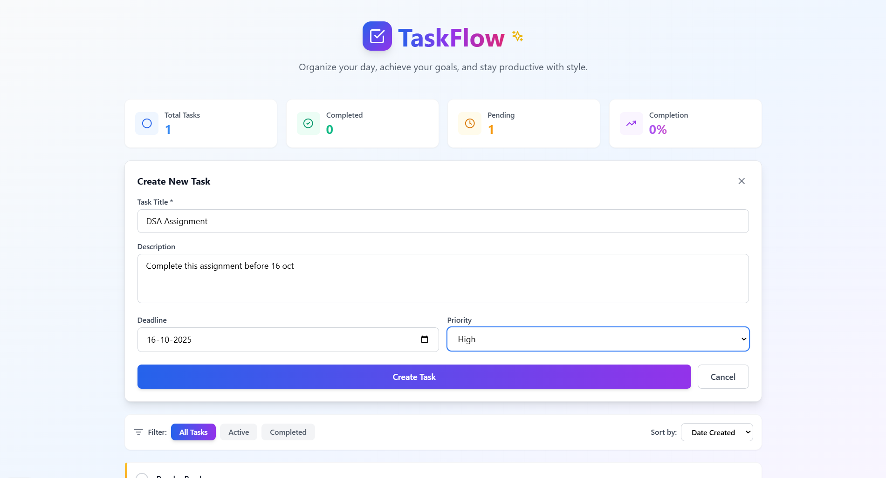

# 🧠 TaskFlow – Smart Task Management App

TaskFlow is a full-stack **Productivity App** built with **TypeScript** designed to help users efficiently manage their tasks with a clean UI and powerful features. With task creation, deadline tracking, and completion monitoring, it's the perfect tool to boost your personal or team productivity.

---

## 🚀 Features

- ✅ **Create, Edit & Delete Tasks**
- 📅 **Set Deadlines and Due Dates**
- 🔔 **Mark Tasks as Complete**
- 🎯 **Track Task Progress**
- 💻 **Modern, Responsive UI Design**
- 🌀 **Smooth Animations & Transitions**
- 🔗 **Backend Integration with MongoDB** (**Upcoming**)

---

## 📸 Screenshots

### 🔍 Task Overview  

### 📝 Create a Task  

---

## 🛠 Tech Stack

**Frontend:**
- React.js (Hooks + Context API)
- TyoeScript
- React Router
- CSS3 / SCSS / Styled-Components

